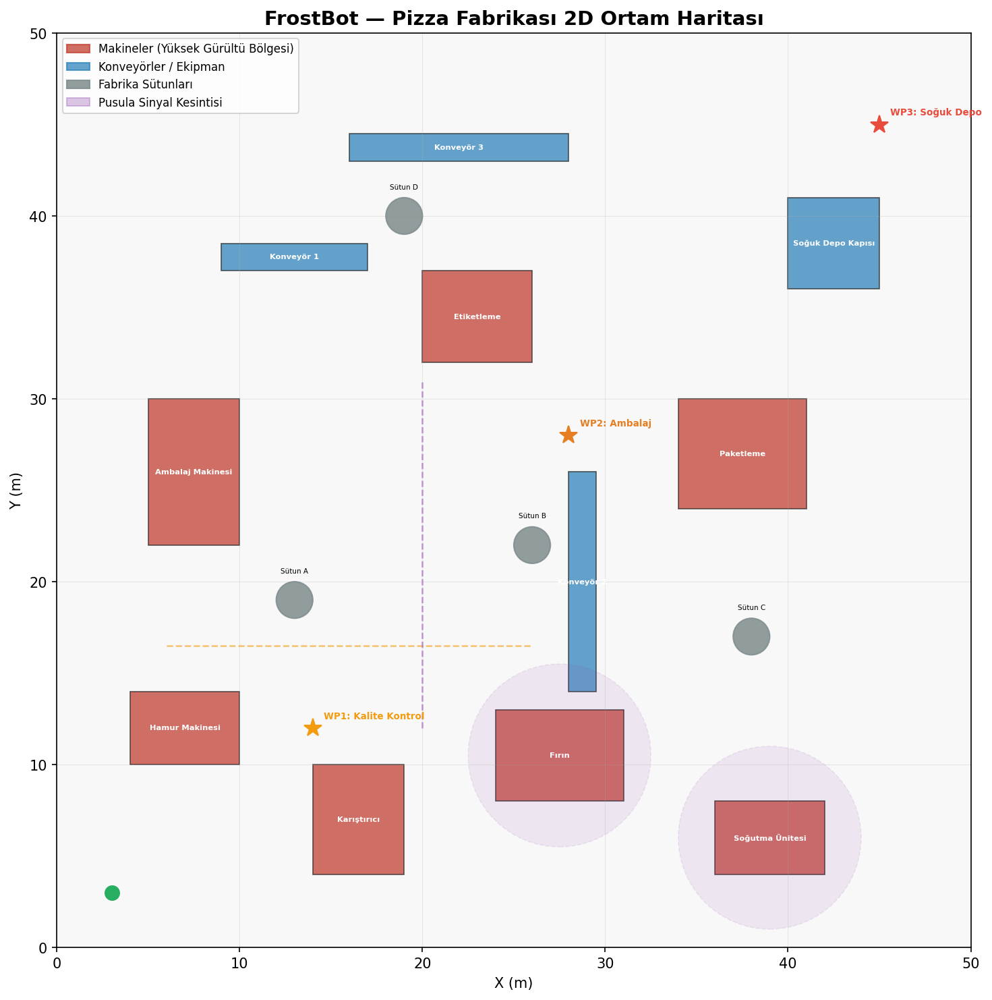
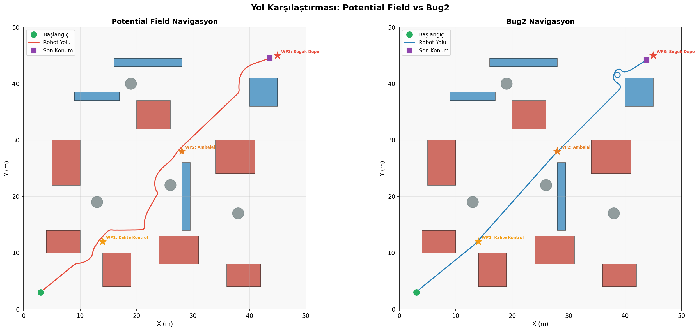
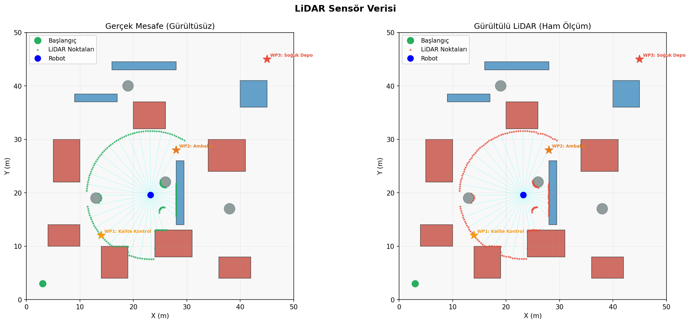
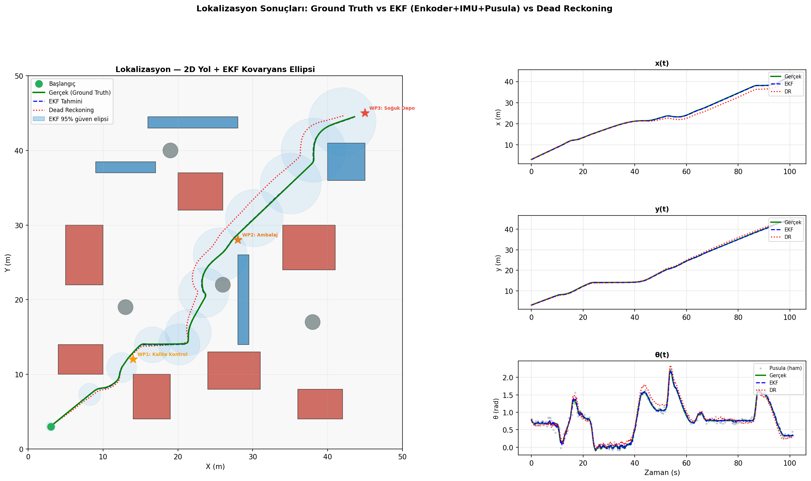
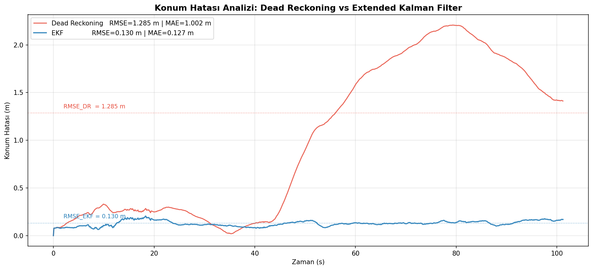
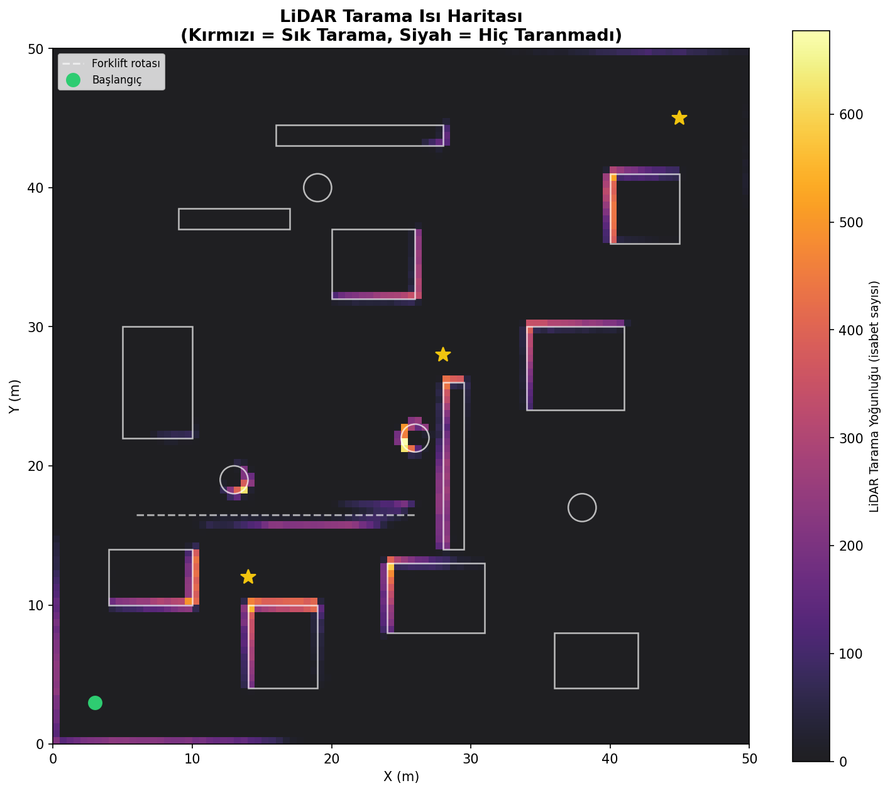
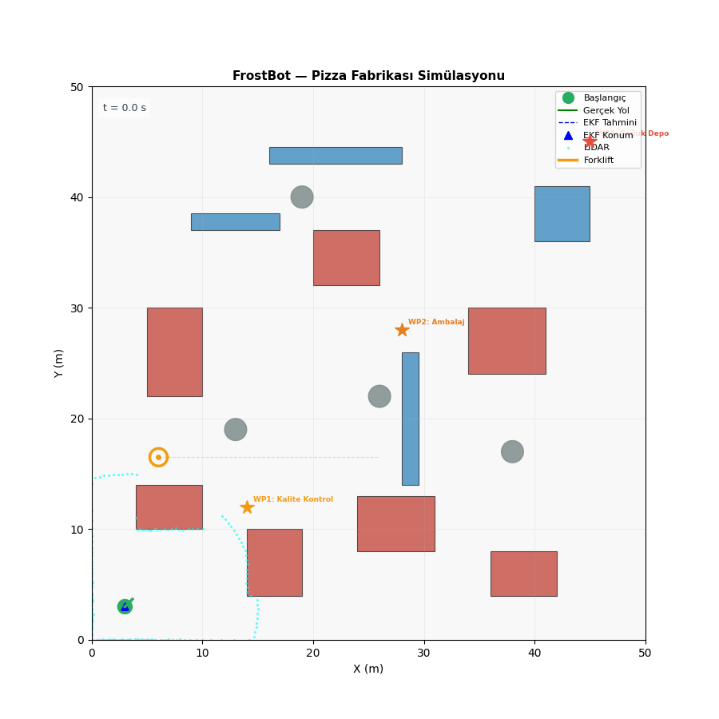

# FrostBot — Autonomous Mobile Robot Sensor Fusion

**2D LiDAR-based autonomous navigation simulation with Extended Kalman Filter (EKF) sensor fusion, localization, and multi-algorithm path planning in a frozen pizza factory environment.**

> Bursa Teknik Üniversitesi — Bilgisayar Mühendisliği — Mekatronik Teknik Seçmeli  
> Öğrenci: Mustafa Can Ersoy

---

## Senaryo / Scenario

A differential-drive robot navigates a **50 × 50 m frozen pizza factory** autonomously, transporting pizzas from the production line to cold storage. The factory contains heavy machinery, conveyor belts, and structural pillars that block direct paths and emit electromagnetic interference — making GPS unusable. The robot relies solely on:

- **LiDAR** — 180-beam 2D scan, max range 12 m
- **IMU** — angular velocity measurement
- **Wheel encoder** — linear and angular velocity from wheel speeds
- **Magnetometer** — absolute heading (theta) measurement, 3× noise in EMI zones

The robot must reach three waypoints in order:

| # | Waypoint | Coordinates |
|---|----------|-------------|
| 1 | Kalite Kontrol (Quality Control) | (14, 12) m |
| 2 | Ambalaj (Packaging) | (28, 28) m |
| 3 | Soğuk Depo (Cold Storage) | (45, 45) m |

Sensor noise is **3× higher** near heavy machinery (electromagnetic interference zones).

---

## Quick Start

```bash
git clone https://github.com/MustafaCanErsoy/autonomous-mobile-robot-sensor-fusion.git
cd autonomous-mobile-robot-sensor-fusion
pip install -r requirements.txt
python main.py
```

**Requirements:** Python 3.9+ · numpy · matplotlib · scipy · pillow

All outputs are saved to the `outputs/` directory automatically.

---

## Visual Outputs

Pre-generated results are available in the [`results/`](results/) folder.

### 1. Factory Environment Map


### 2. Path Comparison — Potential Field vs Bug2


### 3. LiDAR Sensor Data — Raw vs Noisy


### 4. Localization Results — Ground Truth vs EKF vs Dead Reckoning


### 5. Error Analysis


### 6. LiDAR Hit-Point Heatmap


### Animated Simulation (with dynamic forklift)


---

## Features

- **Non-holonomic differential-drive** kinematic model
- **4-sensor simulation** with zone-dependent Gaussian noise (LiDAR, IMU, encoder, magnetometer)
- **Extended Kalman Filter (EKF)** — encoder prediction + IMU update + magnetometer update, Jacobian linearisation
- **3-stage EKF fusion**: encoder (predict) → IMU angular rate (update 1) → magnetometer absolute heading (update 2)
- **EKF covariance ellipses** — visualised 95% confidence regions
- **Dead reckoning** baseline for error comparison
- **Two navigation algorithms**: Potential Field vs Bug2 (with stuck-escape mechanism)
- **Dynamic forklift obstacle** — moves at 0.4 m/s along a horizontal corridor, included in collision detection and LiDAR scans
- **LiDAR hit-point heatmap** — cumulative sensor density map over the full mission, revealing coverage gaps and high-traffic zones
- **Animated simulation** with robot body (circle + heading arrow), live LiDAR beams, and moving forklift
- **Quantitative error analysis**: RMSE and MAE

---

## Project Structure

```
├── main.py               # Entry point — runs both simulations, saves all outputs
├── environment.py        # Factory map: 15 static obstacles + dynamic forklift, vectorised ray casting
├── robot.py              # Differential-drive kinematic model
├── sensors/
│   ├── lidar.py          # 2D LiDAR with noise zones and obstacle clustering
│   ├── imu.py            # Angular velocity sensor
│   ├── encoder.py        # Wheel encoder (v, omega measurement)
│   └── magnetometer.py   # Absolute heading sensor (drift-free, EMI-affected)
├── fusion/
│   └── ekf.py            # Extended Kalman Filter (predict + update)
├── localization.py       # Dead reckoning + RMSE/MAE error metrics
├── navigation.py         # PotentialFieldNav and Bug2Nav
├── visualization.py      # All plots and animation
├── results/              # Pre-generated output images
└── requirements.txt
```

---

## Methods

### Sensor Fusion — Extended Kalman Filter

State vector: **[x, y, θ]**

**Prediction step** (wheel encoder as control input):

```
x'  = x + v·cos(θ)·dt
y'  = y + v·sin(θ)·dt  
θ'  = θ + ω·dt
P'  = F·P·Fᵀ + Q
```

F is the Jacobian of the nonlinear motion model — this is what makes it *Extended* KF rather than standard KF.

**Update step 1** (IMU angular velocity):

The IMU provides a virtual theta observation: `z = θ_prev + ω_imu·dt`. Innovation `z − Hx` captures the discrepancy between IMU and encoder angular rates and corrects theta drift.

**Update step 2** (Magnetometer absolute heading):

The magnetometer measures theta directly in the world frame: `z = θ_true + noise`. Unlike the IMU, it does not integrate and therefore never drifts — but it is noisier (σ = 0.05 rad vs 0.015 rad/s for IMU). In EMI zones the noise triples. Two sequential EKF updates with different R matrices allow each sensor's confidence to be weighted appropriately.

The EKF covariance matrix P is visualised as 95% confidence ellipses on the localization plot — they grow near high-noise machinery zones and shrink in open corridors.

### Navigation

**Potential Field:** Attractive force toward goal + repulsive forces from LiDAR obstacle readings within 2.5 m. Vectorised over all 180 beams per step. Includes stuck-detection with random escape perturbation.

**Bug2:** State machine (GO_TO_GOAL ↔ FOLLOW_WALL). Wall-timeout after 120 steps prevents infinite boundary-following loops in complex obstacle clusters.

### Dead Reckoning (baseline)

Pure encoder integration — no fusion. Accumulates drift over time, used as lower-bound benchmark.

---

## Results

### Localization (Potential Field run, seed=42)

| Metric | EKF | Dead Reckoning | Improvement |
|--------|-----|----------------|-------------|
| RMSE (m) | **0.130** | 1.285 | **−89.8 %** |
| MAE (m)  | **0.127** | 1.002 | **−87.3 %** |

Three-sensor EKF fusion (encoder + IMU + magnetometer) achieves sub-14 cm RMSE — nearly an order of magnitude better than pure odometry. The magnetometer's drift-free absolute heading anchors the EKF's theta estimate, preventing the angular error accumulation that causes large xy drift in dead reckoning.

### Navigation Comparison

| Waypoint | PF Time | PF Distance | Bug2 Time | Bug2 Distance |
|----------|---------|-------------|-----------|---------------|
| Kalite Kontrol | 18.5 s | 13.3 m | 10.8 s | 12.7 m |
| Ambalaj | 65.2 s | 38.0 m | 28.7 s | 34.0 m |
| Soğuk Depo | 101.2 s | 63.3 m | **59.5 s** | 64.2 m |

Bug2 is faster overall (59.5 s vs 101.2 s) because it hugs obstacles directly rather than computing potential fields. Potential Field finds shorter, smoother paths overall. The dynamic forklift obstacle increases path complexity — both algorithms reroute around it in real time.

---

## References

[1] V. Ušinskis, M. Nowicki, A. Dzedzickis and V. Bučinskas, "Sensor-fusion based navigation for autonomous mobile robot," *Sensors*, vol. 25, no. 4, article 1248, 2025. doi: 10.3390/s25041248

[2] Y. Ou, Y. Cai, Y. Sun and T. Qin, "Autonomous navigation by mobile robot with sensor fusion based on deep reinforcement learning," *Sensors*, vol. 24, no. 12, article 3895, 2024. doi: 10.3390/s24123895

[3] B. Zhang and C. Li, "The optimization and application research of the RRT-APF-based path planning algorithm," *Electronics*, vol. 13, no. 24, article 4963, 2024. doi: 10.3390/electronics13244963

---

## AI Usage Declaration

| Tool | Version | Sections |
|------|---------|----------|
| Claude Code (Anthropic) | claude-sonnet-4-6 | System architecture, EKF formulation, navigation algorithms, visualization, README |

**Student contributions:** Scenario concept and design (frozen pizza factory, creative waypoint layout), algorithm and parameter selection decisions, result interpretation, project direction throughout.

AI tools were used as a collaborative coding assistant. All code was reviewed, executed, and validated by the student.
